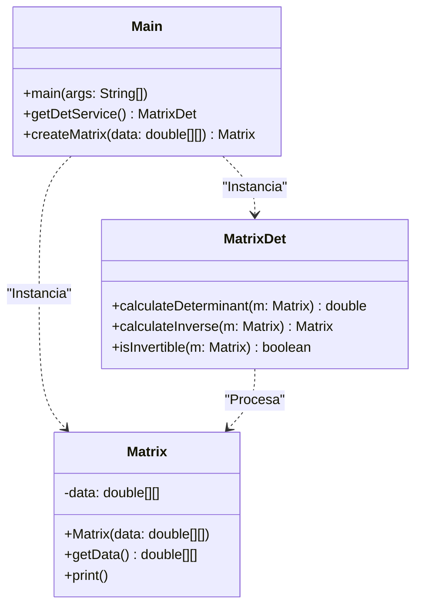
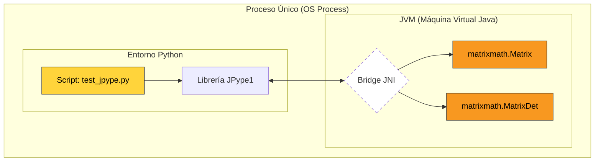
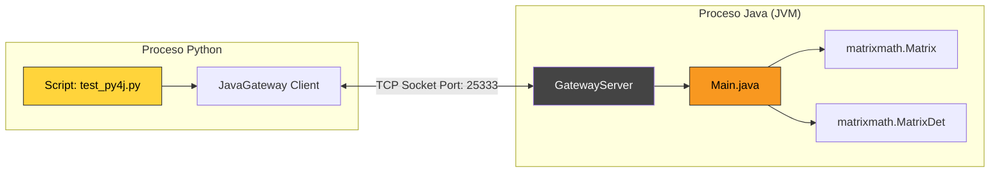

# CalculadoraMatrices

Librería sencilla en Java para sacar determinantes e inversas (2x2 y 3x3). La idea es compilar esto como un **JAR** y usarlo de motor de cálculo en Python, aprovechando una estructura ya existente en Java.

## Estructura de este proyecto

- math.Matrix: El objeto matriz básico.
- math.MatrixService: Los cálculos (determinante, inversa, etc.).
- math.Main: Para probar que todo rula desde la consola.

## Comandos rápidos

Para generar el JAR (se guarda en la carpeta ```/target```):

```bash
mvn clean package
```

Para probar que el motor Java funciona correctamente:

```bash
java -cp target/calculadora-matrices-1.0-SNAPSHOT.jar math.Main
```

## Notas de integración

Si uso JPype, tengo que pasarle la ruta del JAR al iniciar la JVM en el script de Python. Si al final decantamos por Py4J, se tiene que dejar el Main de Java corriendo con el GatewayServer activo para que Python pueda conectar.

He configurado el ```pom.xml``` para que use Java 11, evitando problemas de compatibilidad con las librerías de Python. La carpeta ```/target``` está excluida en el `.gitignore` para no subir basura al repo, siguiendo la lógica del proyecto original.

## Compilación y Construcción del Motor

Java no es como Python; el código no se lee al vuelo. Hay que **empaquetarlo** en un archivo JAR para que las librerías de integración (JPype o Py4J) puedan usarlo.

### Comando de empaquetado

Desde la raíz del proyecto (donde está el _pom.xml_), ejecuto:

```bash
mvn clean package
```

### ¿Cuándo tengo que correr Maven?

1. **Primera ejecución:** Obligatorio para generar la carpeta ```/target``` y el JAR inicial.
2. **Cambios en el código:** Si modifico algo en ```Matrix.java``` o ```MatrixService.java```, tengo que volver a compilar. Si no lo hago, Python seguirá usando la lógica antigua guardada en el JAR.
3. **Limpieza:** Si borro la carpeta ```/target``` para liberar espacio, tendré que ejecutarlo de nuevo antes de volver a Python.

### Resultado del proceso

Si sale ```BUILD SUCCESS```, Maven crea el directorio ```/target``` y mete dentro el archivo ```calculadora-matrices-1.0-SNAPSHOT.jar```.
>Este es el archivo "motor" que se carga desde el script de Python.

Una vez ejecutado el comando `mvn clean package` crea dentro de `/target` las `/classes/`, es decir traduce `Main.java` a `Main.class` con cada archivo `.java`. La estructura de `/target` que queda luego de la primera ejecución de `mvn clean package` es:

```bash
    ├── calculadora-matrices-1.0-SNAPSHOT.jar
    ├── classes
    │   └── math
    │       ├── Main.class
    │       ├── Matrix.class
    │       └── MatrixService.class
    ├── generated-sources
    │   └── annotations
    ├── maven-archiver
    │   └── pom.properties
    └── maven-status
        └── maven-compiler-plugin
            └── compile
```

### Estructura de Clases y funciones

Diagrama de las clases dentro de `/src`



## Arquitectura de Integración: JPype vs. Py4J

### JPype (Memoria Compartida)

En este modelo, Python "engulle" a la JVM. Todo ocurre dentro del mismo proceso de sistema operativo, lo que permite una comunicación de baja latencia.



1. Preparación del motor Java
Es necesario compilar el proyecto con Maven para generar el artefacto en la carpeta target/:

```bash
mvn clean package
```

2. Configuración del entorno Python
Instalar la dependencia mediante Pipenv:

```bash
pipenv install jpype1
```

3. Código de integración
El script de Python debe apuntar al JAR generado en target/ antes de realizar los imports:

```python
    jar_path = os.path.join("target", "calculadora-matrices-1.0-SNAPSHOT.jar")
```


### Py4J (Arquitectura Cliente-Servidor)

Dos procesos independientes. Se hablan por la red local (localhost) a través de un puerto. Si Java se cuelga, Python sigue vivo (y viceversa).

