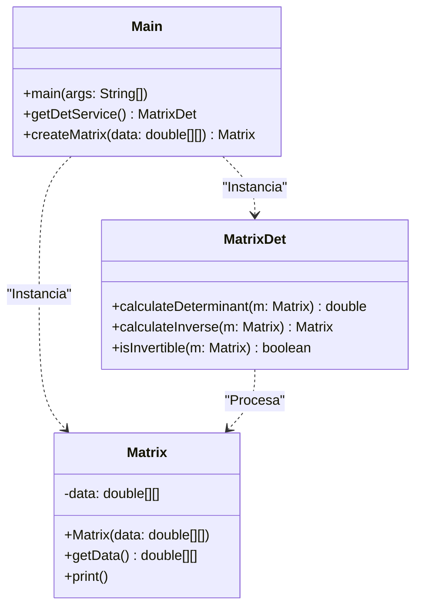
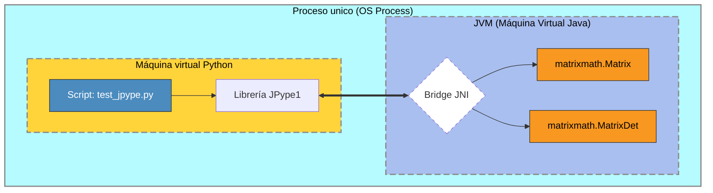
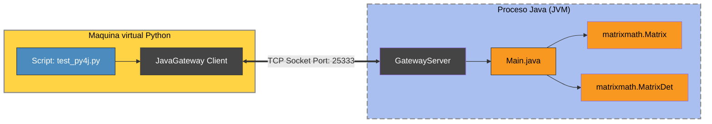

# CalculadoraMatrices: Java-Python

Este proyecto implementa un motor de cálculo matricial desarrollado en Java, diseñado para ser consumido desde entornos Python. El sistema permite realizar operaciones utilizando dos arquitecturas de integración distintas: _JPype_ y _Py4J_.

> [!NOTE]  
> **Entorno de Desarrollo**: Este proyecto ha sido desarrollado en un entorno macOS.

---

## 📋 Tabla de Contenidos

* Requisitos del Sistema
* Arquitectura del Motor
* Compilación y Construcción
* Estrategias de Integración
* Análisis de Rendimiento (Benchmark)

---

## 💻 Requisitos del Sistema

* Sistema Operativo: macOS.
* Java SDK: 11 o superior.
* Apache Maven: Para la gestión de dependencias como Apache Commons Lang y POI.
* Python: 3.9+ gestionado con entorno virtual pipenv.

---

## 🏗️ Arquitectura del Motor

El núcleo lógico se organiza en el paquete `matrixmath`. La estructura comprende la entidad de datos, el servicio de cálculo y los puntos de entrada para los puentes de integración.



## Comandos rápidos

Para generar el JAR (_Java archive_), que se guarda en la carpeta ```/target```:

```bash
mvn clean package
```

Para probar que el motor Java funciona correctamente se ejecuta ese `.jar`:

```bash
java -cp target/calculadora-matrices-1.0-SNAPSHOT.jar math.Main
```

> [!WARNING]  
> Cada vez que se hacen cambios en java se debe actualizar todo el `/target` y el `.jar` ejecutando `mvn clean package`
>

## Notas de integración

Si uso JPype, tengo que pasarle la ruta del JAR al iniciar la JVM en el script de Python. Si al final decantamos por Py4J, se tiene que dejar el Main de Java ejecutando con el GatewayServer activo para que Python pueda conectar.

He configurado el ```pom.xml``` para que use Java 11, evitando problemas de compatibilidad con las librerías de Python. La carpeta ```/target``` está excluida en el `.gitignore` para no subir basura al repo, siguiendo la lógica del proyecto original.

## 🛠️ Compilación y Construcción

Para que el proyecto funcione con dependencias externas (como StringUtils), es crítico empaquetar el motor correctamente.

### Generación del Fat JAR

Para incluir todas las librerías dentro del archivo final, se utiliza el maven-shade-plugin:

``` bash
mvn clean package
```

### Gestión Dinámica de Dependencias

Si se prefiere cargar las librerías por separado desde Python, se deben copiar al directorio `/target`:

``` bash
mvn dependency:copy-dependencies
```

### Comando de empaquetado

Desde la raíz del proyecto (donde está el _pom.xml_), ejecuto:

```bash
mvn clean package
```

### ¿Cuándo tengo que ejecutar Maven?

1. **Primera ejecución:** Obligatorio para generar la carpeta ```/target``` y el JAR inicial.
2. **Cambios en el código:** Si modifico algo en ```Matrix.java``` o ```MatrixService.java```, tengo que volver a compilar. Si no lo hago, Python seguirá usando la lógica antigua guardada en el JAR.
3. **Limpieza:** Si borro la carpeta ```/target``` para liberar espacio, tendré que ejecutarlo de nuevo antes de volver a Python.


### Resultado del proceso

Si sale ```BUILD SUCCESS```, Maven crea el directorio ```/target``` y mete dentro el archivo ```calculadora-matrices-1.0-SNAPSHOT.jar```.
>Este es el archivo "motor" que se carga desde el script de Python.

Una vez ejecutado el comando `mvn clean package` crea dentro de `/target` las `/classes/`, es decir traduce `Main.java` a `Main.class` con cada archivo `.java`. La estructura de `/target` que queda luego de la primera ejecución de `mvn clean package` es:

```bash
    ├── calculadora-matrices-1.0-SNAPSHOT.jar
    ├── classes
    │   └── math
    │       ├── Main.class
    │       ├── Matrix.class
    │       └── MatrixService.class
    ├── generated-sources
    │   └── annotations
    ├── maven-archiver
    │   └── pom.properties
    └── maven-status
        └── maven-compiler-plugin
            └── compile
```

## 🔗 Estrategias de Integración

### JPype (Memoria Compartida)

JPype carga la JVM dentro del proceso de Python, permitiendo llamadas a nivel de memoria compartida. 

``` python
import jpype
import os

# Carga dinámica del classpath incluyendo dependencias externas
jar_path = "target/proyecto-abaco-0.0.1-SNAPSHOT.jar"
lib_folder = "target/dependency"
classpath = [jar_path]

if os.path.exists(lib_folder):
    for lib in os.listdir(lib_folder):
        if lib.endswith(".jar"):
            classpath.append(os.path.join(lib_folder, lib))

if not jpype.isJVMStarted():
    jpype.startJVM(classpath=classpath)
```



1. __Preparación del motor Java:__ Es necesario compilar el proyecto con Maven para generar el artefacto en la carpeta target/:

```bash
mvn clean package
```

2. __Configuración del entorno Python:__ Instalar la dependencia mediante Pipenv:

```bash
pipenv install jpype1
```

3. __Código de integración:__ El script de Python debe apuntar al JAR generado en target/ antes de realizar los imports:

```python
    jar_path = os.path.join("target", "calculadora-matrices-1.0-SNAPSHOT.jar")
```

### Por qué usar Jpype ([según la documentación oficial](https://jpype.readthedocs.io/en/latest/userguide.html#why-use-jpype))

`JPype` facilita la integración de Python y Java, permitiendo a los desarrolladores:
* Acceder a las bibliotecas de Java directamente desde el código Python.
* Depurar estructuras de datos Java de forma interactiva mediante herramientas de Python.
* Aprovechar la flexibilidad de Python para la computación científica y la robustez de Java para aplicaciones empresariales.

### Py4J (Arquitectura Cliente-Servidor)

Establece un puente mediante sockets TCP/IP. Requiere iniciar el GatewayServer desde Java antes de conectar desde Python.

``` bash
# Ejecución del servidor (Terminal 1)
mvn exec:java -Dexec.mainClass="matrixmath.Main" -Dexec.args="server"
```



1. __Dependencia en Java:__ 

    Añadir al archivo `pom.xml`. Este bloque le indica al gestor de dependencias que necesita la librería física de Py4J para poder compilar y ejecutarse.

    Sin esta línea, no se puede usar `import py4j.GatewayServer;` en Java, el compilador busca en sus archivos, no encuentra nada y lanza el error: `package py4j does not exist`.

    ```XML
    <dependency>
        <groupId>net.sf.py4j</groupId>
        <artifactId>py4j</artifactId>
        <version>0.10.9.7</version>
    </dependency>
    ```

2. __Servidor Java (Gateway):__ 
   
   Modificar el método main en `src/main/java/matrixmath/Main.java`:

    ```java
    public static void main(String[] args) {
        GatewayServer server = new GatewayServer(new Main());
        server.start();
        System.out.println("Servidor Py4J activo");
    }
    ```

3. __Código de integración en Python:__ 
    
    Instalar la librería:

    ```python
    pipenv install py4j
    ```

#### 1. Lanzamiento del Servidor Java (Terminal 1)

Antes de ejecutar el script de Python, el servidor Java debe estar "escuchando". Hay dos formas de lanzarlo:

- __Opción A__: Usando Maven (más fácil). _Maven se encarga de gestionar todas las librerías (incluida la de Py4J)_:

    ```Bash
    mvn exec:java -Dexec.mainClass="matrixmath.Main"
    ```

- __Opción B__: Usando el JAR directamente. _Incluir la librería de Py4J en el classpath manual_:

    ```Bash
    java -cp "target/calculadora-matrices-1.0-SNAPSHOT.jar:ruta/a/py4j.jar" matrixmath.Main
    ```

_(Nota: En Mac, el separador de carpetas es : y en Windows es ;)._

#### 2. Ejecución del Cliente Python (Terminal 2)

Una vez que en la Terminal 1 esté el Servidor Py4J activo, se lanza el __cliente Python__ con el script:

```Bash
pipenv run python test_py4j.py
```

Por ejemplo ejecutamos: 

```python
from py4j.java_gateway import JavaGateway

# Conexión al proceso Java externo
gateway = JavaGateway()
app = gateway.entry_point

# Acceso a los servicios definidos en el Main de Java
service = app.getDetService()
matriz = app.createMatrix([[1.0, 0.0], [0.0, 1.0]])

print(f"Resultado: {service.calculateDeterminant(matriz)}")
```

> [!WARNING]  
>**Diferencias en el manejo de tipos (Matrices 2D)**
>- **JPype**: Conversión transparente de `list[list]` a `double[][]`. Alta eficiencia.
>- **Py4J**: Requiere creación manual del array en la JVM mediante `gateway.new_array(gateway.jvm.double, rows, cols)`. Cada asignación de celda implica una comunicación por socket, lo que aumenta la latencia en matrices >grandes.
>

## 📊 Análisis de Rendimiento (Benchmark)

Resultados obtenidos tras promediar 5 ejecuciones de cálculo matricial 3x3 y 10x10.

>El programa calcula:
>_Determinante e Inversa_

* Modo secuencial: 5 ejecuciones del programa una tras otra.
* Modo multi-hilo: 5 hilos con `threading.Thread()` de python.


### Resultados con Matriz 3x3

El tiempo `Total` se mide al inicio y al fin del ciclo de vida del programa usando la función `time.perf_counter()`.


```bash
    📊 ANÁLISIS SECUENCIAL (log_ejecucion_jpype.log)
    Muestras: 12
    Promedio Java:      0.00000992 s
    Promedio Algoritmo: 0.04258892 s
    Promedio Total:     0.42630150 s
    Desviación Estndar: 0.99473059 s
    ----------------------------------------
    📊 ANÁLISIS SECUENCIAL (log_ejecucion_py4j.log)
    Muestras: 10
    Promedio Socket:    0.00237300 s
    Promedio Algoritmo: 0.00019130 s
    Promedio Total:     0.02779070 s
    Desviación Estndar: 0.00169938 s
    ----------------------------------------
    🚀 ANÁLISIS MULTI-HILO (log_multihilo_jpype.log)
    Ejecuciones: 10
    Tiempo Total Promedio: 0.06198290 s
    Desviación Estándar:   0.00405427 s
    Mejor Tiempo:          0.05813800 s
    ----------------------------------------
    🚀 ANÁLISIS MULTI-HILO (log_multihilo_py4j.log)
    Ejecuciones: 10
    Tiempo Total Promedio: 0.00771430 s
    Desviación Estándar:   0.00237184 s
    Mejor Tiempo:          0.00587500 s
    ----------------------------------------
```

### Resultados con matriz 10x10

El tiempo `Total` se mide al inicio y al fin del ciclo de vida.

```bash
    📊 ANÁLISIS SECUENCIAL (log_ejecucion_jpype_10x10.log)
    Muestras: 3
    Promedio Java:      0.00002233 s
    Promedio Algoritmo: 0.25030000 s
    Promedio Total:     2.50360233 s
    Desviación Estndar: 0.02379751 s
    ----------------------------------------
    📊 ANÁLISIS SECUENCIAL (log_ejecucion_py4j_10x10.log)
    Muestras: 3
    Promedio Socket:    0.02438633 s
    Promedio Algoritmo: 0.24847733 s
    Promedio Total:     2.73245933 s
    Desviación Estndar: 0.02726121 s
    ----------------------------------------
    🚀 ANÁLISIS MULTI-HILO (log_multihilo_jpype_10x10.log)
    Ejecuciones: 5
    Tiempo Total Promedio: 0.41597580 s
    Desviación Estándar:   0.01172115 s
    Mejor Tiempo:          0.40139400 s
    ----------------------------------------
    🚀 ANÁLISIS MULTI-HILO (log_multihilo_py4j_10x10.log)
    Ejecuciones: 5
    Tiempo Total Promedio: 0.15529720 s
    Desviación Estándar:   0.01509784 s
    Mejor Tiempo:          0.14631400 s
    ----------------------------------------
```


🔗 [Discusion sobre los hilos en Jpype (Desarrolladores del proyecto)](https://github.com/jpype-project/jpype/issues/1169)

🔗 [Sobre los Threads en Jpype (Documentación del proyecto)](https://jpype.readthedocs.io/en/latest/userguide.html#threading)

🔗 [Sobre los Threads en Py4j (Documentación del proyecto)](https://www.py4j.org/faq.html#is-py4j-thread-safe)

### Comentarios sobre Jpype

* `Jpype` permite a python la iteracción entre las librerías Java y Python, así como el uso y desarrolo de estructuras y objetos. Todo esto ocurre en un solo proceso de memoria compartida. `JPype` conecta Python y Java a nivel nativo utilizando la Interfaz Nativa de Java (JNI), sin ls necesidad de serializar objetos al comunicarse.
* `Jpype` requiere que la JVM se inicie antes de interactuar con Java.
* `Jpype` es más rápido en ejecuciones secuenciales, tanto en instancias pequeñas como grandes.
* `Jpype` comparte memoria con la JVM en todos los procesos.
* `Jpype` tiene problemas para trabajar con hilos desde python. Hay que conocer a profundidad cómo funciona la integración para poder optimizar los hilos, por ejemplo __dónde y cómo__ hacer el  `detach` de cada proceso.
* Los hilos de Python son "extraños" para la JVM y deben ser adjuntados (attach) manualmente o automáticamente para que la JVM reserve un stack de memoria para ellos. Si no se _desadjuntan_ (detach), se producen fugas de memoria.
  
### Comentarios sobre Py4j

* `Py4j` permite que los programas Python que se ejecutan en un intérprete de Python accedan dinámicamente a objetos Java en una JVM. También permite que los programas Java llamen a objetos Python.
* `Py4j` mantiene los procesos aislados entre la JVM y Python
* `Py4j` funciona bajo una arquitectura de Cliente-Servidor totalmente independiente, comunicándose a través de sockets de red local (TCP/IP).
* `Py4j`. Python corre en un PID y la JVM corre en otro PID totalmente distinto. No comparten memoria RAM de forma directa.
* `Py4j`. Por defecto, Python envía comandos al puerto 25333 y Java responde por el puerto 25334.
* `Py4j` no se ve afectada por el Global Interpreter Lock (GIL) de Python. Cada hilo de Python abre su propia conexión, lo que permite que Java use todos los núcleos del procesador sin interferencias.

### Comparativa de Gestión de Memoria

| Característica | JPype | Py4J |
| --- | --- | --- | 
Arquitectura |Proceso Único (In-process) |Multi-proceso (Client-Server) |
Comunicación |JNI / Memoria Compartida |Sockets TCP/IP (Localhost)
| Transferencia de Datos | Punteros/Proxies (Muy rápida) |Serialización (Más lenta) |
| Gestión de Hilos | Requiere `attach/detach` | Conexiones independientes por hilo |
| Estabilidad | Sensible a fallos de JNI (Crash del proceso) | Robusta (Si uno cae, el otro sobrevive) |

---

## 🚀 Flujo de Trabajo

Pasos para ejecutar el método `main` de una clase Java utilizando tanto __JPype__ como __Py4J__.

